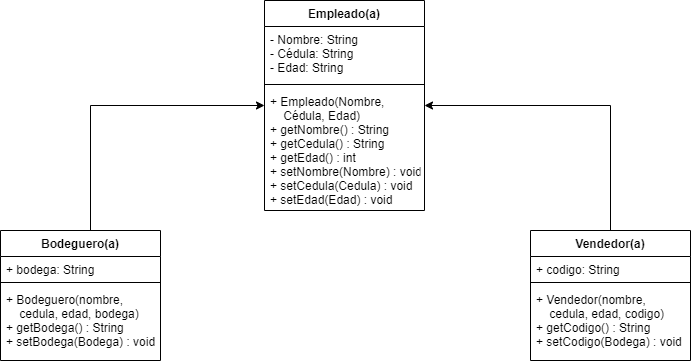

# Proyecto Final 
Elaborado por Marianela Ormasis Rojas para la clase de Programación Orientada a objetos impartida por Marco Vargas, profesor de la Universidad Creativa, II Cuatrimestre de 2021

## Descripción del Proyecto
Tita's Shoes es una empresa que se dedica la venta de Zapatos, en la actualidad tienen muchos empleados de varios tipos y estos se manejan por medio de Excel. 
La idea del proyecto es automatizar el registro de empleados de dos tipos (Bodegueros(as) y Vendedores(as)).
Por medio de la implementación de un sistema automático lograremos hacer que la empresa no pierda registros de empleados que actualmente trabajan con ellos y agilizar el registro de los nuevos.

## Requisitos
Para correr el proyecto es necesario tener instalado 
1. Java SDK 16.0.1
2. Java JRE 
3. IntelliJ como IDE 

## Diagrama UML 
